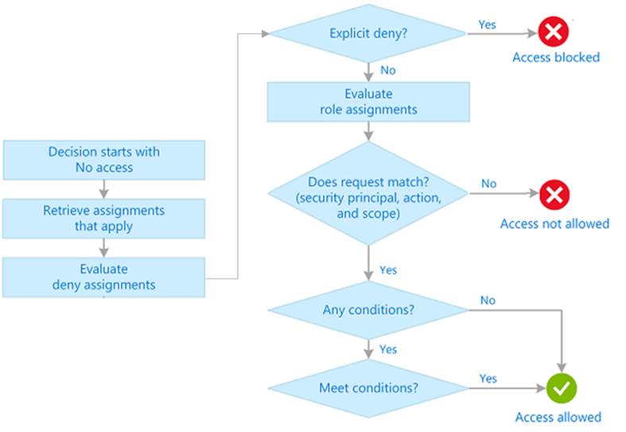

# Design Identity, Governance, and Monitoring Solutions (25-30%)

## Design a solution for logging and monitoring
* design a log routing solution
* recommend an appropriate level of logging
* recommend monitoring tools for a solution
## Design authentication and authorization solutions
* recommend a solution for securing resources with role-based access control
* recommend an identity management solution
* recommend a solution for securing identities
## Design governance
* recommend an organizational and hierarchical structure for Azure resources

  * structure
    * Tenant > (Management groups) > Subscritions > Resource groups > Resources

      * **[Management groups](https://docs.microsoft.com/en-us/azure/governance/management-groups/overview)** help you manage access, policy, and compliance for multiple subscriptions.

        * A management group tree can support up to six levels of depth.

          * This limit doesn't include the Root level or the subscription level.

        * [hierarchy protection](https://docs.microsoft.com/en-us/azure/governance/management-groups/how-to/protect-resource-hierarchy)

      * **Subscriptions** are logical containers that serve as units of management and scale. Subscriptions are also billing boundaries.

      * **Resource groups** are logical containers into which Azure resources are deployed and managed.

      * **Resources** are instances of services that you create. For example, virtual machines, storage, and SQL databases.

  * governance strategies

    * Azure Policies

      * triggers

        * A resource has been created, deleted, or updated in scope with a policy assignment.

        * A policy or an initiative is newly assigned to a scope.

        * A policy or an initiative that’s been assigned to a scope is updated.

        * The standard compliance evaluation cycle (happens once every 24 hours).

      * behaivor

        * Deny a change to a resource.

        * Log changes to a resource.

        * Alter a resource before or after a change.

        * Deploy related compliant resources.

      * In some cases, Azure Policy can automatically remediate noncompliant resources

    * RBAC

      

    * Resource tags

* recommend a solution for enforcing and auditing compliance

  * Azure policy

    * use tags

## Design identities and access for applications
* recommend solutions to allow applications to access Azure resources
* recommend a solution that securely stores passwords and secrets
* recommend a solution for integrating applications into Azure Active Directory (Azure AD)
  
|||
|-|-|
|Provide identity and access management for employe    es in a cloud or hybrid environment.|Azure Active Directory (Azure AD)|
|Collaborate with guest users and external business partners like suppliers and vendors.|Azure AD Business to Business (B2B)|
|Control how customers sign up, sign in, and manage their profiles when they use your applications.|Azure AD Business to Consumer (B2C)|

* recommend a user consent solution for applications