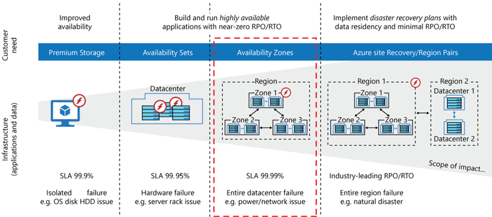

<link href="../../style/style.css" rel="stylesheet"></link>

# Design Business Continuity Solutions (10-15%)

## Design a solution for backup and disaster recovery
* recommend a recovery solution for Azure, hybrid, and on-premises workloads that meets 
recovery objectives (Recovery Time Objective [RTO], Recovery Level Objective [RLO], 
Recovery Point Objective [RPO])
* understand the recovery solutions for containers
* recommend a backup and recovery solution for compute
* recommend a backup and recovery solution for databases
* recommend a backup and recovery solution for unstructured data

## [Design for high availability](https://docs.microsoft.com/en-us/learn/modules/design-for-high-availability/)

* identify the availability requirements of Azure resources

  * Consider cost and complexity

    * To achieve four nines (99.99%), you can't rely on manual intervention to recover from failures. The application must be self-diagnosing and self-healing.

    * Beyond four nines, it's challenging to detect outages quickly enough to meet the SLA.
     
    * Think about the time window that your SLA is measured against. The smaller the window, the tighter the tolerances(公差). It doesn't make sense to define your SLA in terms of hourly or daily uptime.
     
    * Consider the mean time between failures (MTBF) and mean time to recover (MTTR) measurements. The higher your SLA, the less frequently the service can go down and the quicker the service must recover.

  * Availability metrics
  
    * Mean time to recover (MTTR) is the average time it takes to restore a component after a failure.

    * Mean time between failures (MTBF) is the how long a component can reasonably expect to last between outages.

  * [Azure Front Door](https://docs.microsoft.com/en-us/azure/frontdoor/front-door-overview) Application Delivery Network (ADN)

    * Compare with other services
     
      * LB is at Layer 4.  

      * Front Door is a non-regional service whereas Application Gateway is a regional service.

    * offers Layer 7 capabilities for your application like SSL offload, path-based routing, fast failover, caching, etc. to improve performance and high-availability of your applications.

    * builds on

      * **Primary and secondary region.** This architecture uses two regions to achieve higher availability. The app is deployed to each region. During normal operations, network traffic is routed to the primary region. If the primary region becomes unavailable, traffic is routed to the secondary region.

      * **Front Door.** Front Door routes incoming requests to the primary region. If the application running that region becomes unavailable, Front Door fails over to the secondary region.

      * **Geo-replication.** Geo-replication of SQL Database and/or Cosmos DB.

    * High availability scenarios

      |Approach|Description|
      |:-|:-|
      |Active/passive with hot standby|Traffic goes to one region, while the other waits on hot standby. Hot standby means the VMs in the secondary region are always running.|
      |Active/passive with cold standby|Traffic goes to one region, while the other waits on cold standby. Cold standby means the VMs in the secondary region aren’t allocated until needed for failover. This approach costs less to run but will generally take longer to come online during a failure.|
      |Active/active|Both regions are active, and requests are load balanced between them. If one region becomes unavailable, it’s taken out of rotation.|

  * [Azure Traffic Manager](https://docs.microsoft.com/en-us/azure/traffic-manager/traffic-manager-overview) DNS-based traffic load balancer

    * Because Traffic Manager is a DNS-based load-balancing service, it load balances only at the domain level. For that reason, it can't fail over as quickly as Front Door, because of common challenges around DNS caching and systems not honoring DNS TTLs.

    * typical scenario

      1. The user petitions a DNS server.

      1. The DNS server queries Traffic Manager for the required record(s).

      1. The result is returned from Traffic Manager.

      1. The client connects directly to the defined endpoint.

      

    
    * High availability scenarios

      |Approach|Description|
      |:-|:-|
      |Active/passive with hot standby|Your VMs (and other appliances) that are running in the standby region aren't active until needed. However, your production environment is replicated to a different region. This approach is cost-effective but takes longer to undertake a complete failover.|
      |Active/passive with cold standby|You establish the standby environment with a minimal configuration; it has only the necessary services running to support a minimal and critical set of apps. In its default form, this approach can only execute minimal functionality. However, it can scale up and spawn more services, as needed, to take more of the production load during a failover.|
      |Active/active|Your standby region is pre-warmed and is ready to take the base load. Auto scaling is on, and all the instances are up and running. This approach isn't scaled to take the full production load but is functional, and all services are up and running.|

      * implement failover

        * Manually
          by using Azure DNS, this failover solution uses the standard DNS mechanism to fail over to your backup site. This option works best when used in conjunction with the cold standby or the pilot light approaches.

        * Automatically
          by using Traffic Manager, with more complex architectures and multiple sets of resources capable of performing the same function, you can configure Azure Traffic Manager (based on DNS). Traffic Manager checks the health of your resources and routes the traffic from the non-healthy resource to the healthy resource automatically.

* recommend a high availability solution for compute

  * Availability Zone

    * 99.99% SLA

      

    > region -> zone -> data center

* recommend a high availability solution for non-relational data storage
* recommend a high availability solution for relational data storage
